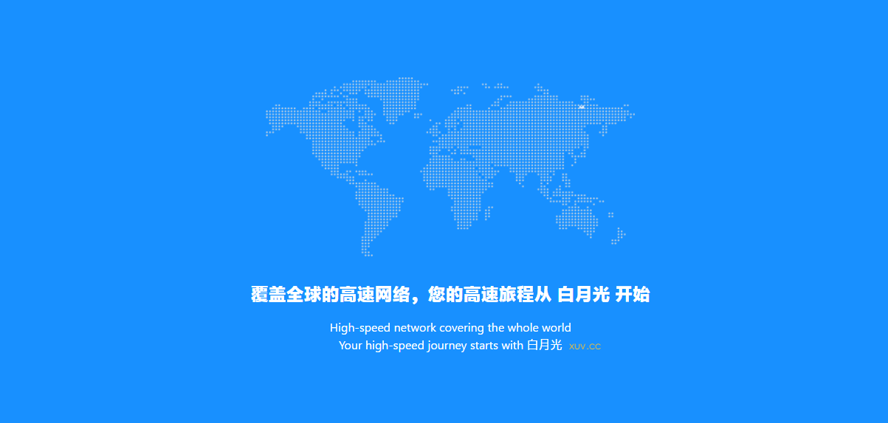
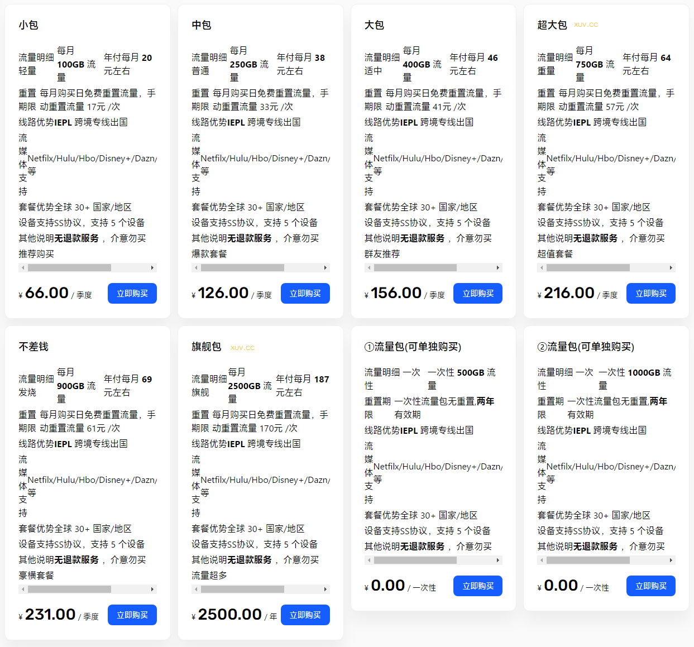

# 白月光官网地址2024最新入口 + 限时优惠码

白月光跑路了吗？暂时没有。不过机场总会有跑路风险，为尽可能减少损失，选购套餐可按月支付。下面是白月光官网最新地址：

永久官网：[bygcloud.com](https://xuv.cc/out/byg)

地址1：[https://asiassn.com](https://www.asiassn.com/#/login?code=ftp0kekc)

地址2：[https://www.sibker.com](https://www.sibker.com/register?code=ftp0kekc)

## 白月光机场特色简介

白月光机场，老牌稳定，节点采用 Shadowsocks 协议，隧道中转进行加速，IEPL 专线网络，线路负载均衡，稳定性不错。

白月光除了常规包月套餐之外，也有不限时长的按量付费套餐可供选择，适合轻度翻墙用户。

### 白月光特色

* 全球30+国家接入
* 支持IEPL专线
* 在线5IP
* SS协议
* 全节点解锁流媒体
* 提供TG群服务支持

## 白月光机场套餐价格

|套餐|小包|中包|大包|超大包|不差钱|旗舰包|流量包500G|流量包1000G|
|----|----|----|----|----|----|----|----|----|
|月付|￥20|￥25|￥36|￥54|￥71|￥187|-|-|
|季付|￥66|￥84|￥120|￥180|￥210|-|-|-|
|半年付|￥132|￥168|￥240|￥360|￥420|-|-|-|
|年付|￥264|￥336|￥480|￥720|￥840|￥2500|-|-|
|两年付|￥528|￥672|￥960|￥1440|￥1680|￥5000|-|-|
|一次性|-|-|-|-|-|-|￥220|￥400|

> 一次性包无有效期，用完为止。

## 白月光优惠码

白月光机场优惠券，最新全场8折通用优惠劵，长期优惠券：

半年付95折：[BYG05OFFHA](https://xuv.cc/out/byg)

年付9折：[BYG10OFFAN](https://xuv.cc/out/byg)

两年付85折：[BYG15OFFTY](https://xuv.cc/out/byg)
